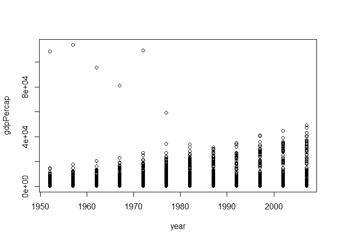

Gapminder Exploration
================
Haohui Zhong
2019/9/17

## *Outline*

In this document, we are going to do some data exploration with the
`gapminder` dataset.

### Load Packages

In order to access the `gapminder` dataset, we need to load the
`gapminder` package.

By executing the following chunks, we will be able to have some basic
ideas of the `gapminder` dataset.

  - What does this dataset contain?

Obtaining such information can be done by checking out the description
excerpt of the dataset.

    ## starting httpd help server ... done

This excerpt is very resourceful for peopole to learn more about the
dataset. As shown, details for life expectancy, GDP per capita, and
population by country are provided within the dataset.

The excerpt also includes brief instructions on how to further explore
`gapminder` in the \`**Examples**’ section. For instance, we can find
out:

> a general description of gapminder

    ##         country        continent        year         lifeExp     
    ##  Afghanistan:  12   Africa  :624   Min.   :1952   Min.   :23.60  
    ##  Albania    :  12   Americas:300   1st Qu.:1966   1st Qu.:48.20  
    ##  Algeria    :  12   Asia    :396   Median :1980   Median :60.71  
    ##  Angola     :  12   Europe  :360   Mean   :1980   Mean   :59.47  
    ##  Argentina  :  12   Oceania : 24   3rd Qu.:1993   3rd Qu.:70.85  
    ##  Australia  :  12                  Max.   :2007   Max.   :82.60  
    ##  (Other)    :1632                                                
    ##       pop              gdpPercap       
    ##  Min.   :6.001e+04   Min.   :   241.2  
    ##  1st Qu.:2.794e+06   1st Qu.:  1202.1  
    ##  Median :7.024e+06   Median :  3531.8  
    ##  Mean   :2.960e+07   Mean   :  7215.3  
    ##  3rd Qu.:1.959e+07   3rd Qu.:  9325.5  
    ##  Max.   :1.319e+09   Max.   :113523.1  
    ## 

> how many **rows** and **columns** gapminder has

    ## [1] 1704

    ## [1] 6

etc.

-----

After we finish running all those codes, we should be familiar with the
dataset. The next step is to perform data explorations at a higher level
and do some transformations.

## *Data Analysis*

### Maximum, minimun, mean, range

We can take a closer look into different **variables**. Take `GDP per
capita` as an example:

    ##     Min.  1st Qu.   Median     Mean  3rd Qu.     Max. 
    ##    241.2   1202.1   3531.8   7215.3   9325.5 113523.1

### Selecting certain values and filtering data

We have already learned that this is a large dataset. Therefore,
inevitably we need to break it down and select or filter data based on
certain criteria.

> Suppose that we are carrying out **continent-specific** studies and
> interested in **Oceania**.

    ## # A tibble: 24 x 6
    ##    country   continent  year lifeExp      pop gdpPercap
    ##    <fct>     <fct>     <int>   <dbl>    <int>     <dbl>
    ##  1 Australia Oceania    1952    69.1  8691212    10040.
    ##  2 Australia Oceania    1957    70.3  9712569    10950.
    ##  3 Australia Oceania    1962    70.9 10794968    12217.
    ##  4 Australia Oceania    1967    71.1 11872264    14526.
    ##  5 Australia Oceania    1972    71.9 13177000    16789.
    ##  6 Australia Oceania    1977    73.5 14074100    18334.
    ##  7 Australia Oceania    1982    74.7 15184200    19477.
    ##  8 Australia Oceania    1987    76.3 16257249    21889.
    ##  9 Australia Oceania    1992    77.6 17481977    23425.
    ## 10 Australia Oceania    1997    78.8 18565243    26998.
    ## # ... with 14 more rows

We can also extract data of certain year, country, etc.

### Visualizing the dataset

Graphics make data more readable and show messages such as trends,
variances and abundance directly. For example, we can show how GDP per
capita of all countries changes over time.

<!-- -->
