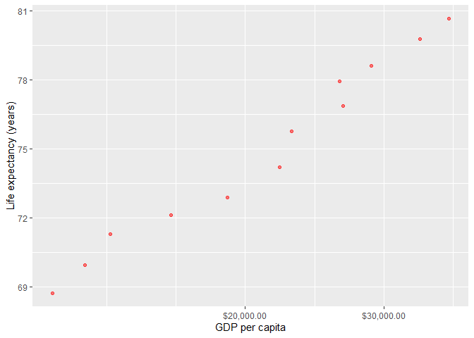
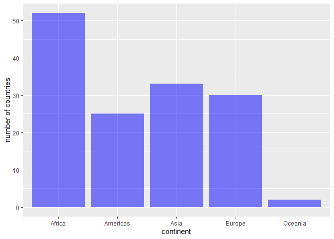
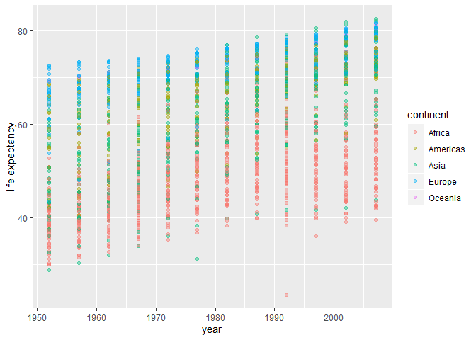
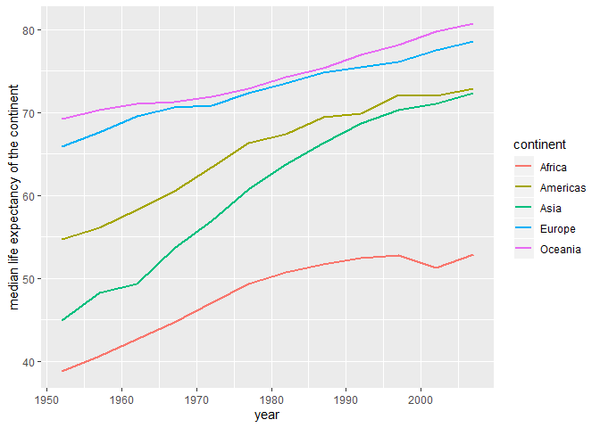

hw02\_dplyr\_exploration
================
Haohui Zhong
2019/9/23

# **Outline**

When exploring datasets, `dplyr` commands can be a very useful tool.
Here, we would be focusing on the `gapminder` dataset. In order to do
so, we need to load the `gapminder` package as well as the `tidyverse`
package.

    ## -- Attaching packages ------------------------ tidyverse 1.2.1 --

    ## √ ggplot2 3.2.0     √ purrr   0.3.2
    ## √ tibble  2.1.3     √ dplyr   0.8.3
    ## √ tidyr   1.0.0     √ stringr 1.4.0
    ## √ readr   1.3.1     √ forcats 0.4.0

    ## -- Conflicts --------------------------- tidyverse_conflicts() --
    ## x dplyr::filter() masks stats::filter()
    ## x dplyr::lag()    masks stats::lag()

<br>

# Exercise 1: Basic `dplyr`

## 1.1 `filter()`

*Requirement:* Use `filter()` to subset the `gapminder` data to three
countries of our choice in the 1970s. Here I choose **China**, **Chad**
and **Chile**.

``` r
gapminder %>%
  filter(year > 1969 & year < 1980) %>% 
  filter(country == "China" | country == "Chad" | country == "Chile") %>% 
  knitr::kable()
```

| country | continent | year |  lifeExp |       pop | gdpPercap |
| :------ | :-------- | ---: | -------: | --------: | --------: |
| Chad    | Africa    | 1972 | 45.56900 |   3899068 | 1104.1040 |
| Chad    | Africa    | 1977 | 47.38300 |   4388260 | 1133.9850 |
| Chile   | Americas  | 1972 | 63.44100 |   9717524 | 5494.0244 |
| Chile   | Americas  | 1977 | 67.05200 |  10599793 | 4756.7638 |
| China   | Asia      | 1972 | 63.11888 | 862030000 |  676.9001 |
| China   | Asia      | 1977 | 63.96736 | 943455000 |  741.2375 |

## 1.2 `select()`

*Requirement:* Use the pipe operator ‘%\>%’ to select ‘“country”’ and
‘“gdpPercap”’ from our filtered dataset in *1.1*.

``` r
gapminder %>%
  filter(year > 1969 & year < 1980) %>% 
  filter(country == "China" | country == "Chad" | country == "Chile") %>%
  select(country,gdpPercap) %>% 
  knitr::kable()
```

| country | gdpPercap |
| :------ | --------: |
| Chad    | 1104.1040 |
| Chad    | 1133.9850 |
| Chile   | 5494.0244 |
| Chile   | 4756.7638 |
| China   |  676.9001 |
| China   |  741.2375 |

## 1.3 `mutate()`

*Requirement:* Filter `gapminder` to all entries that have experienced a
drop in life expectancy and include a new variable that’s the increase
in life expectancy in the tibble.

``` r
gapminder %>% 
  group_by(country) %>% 
  arrange(year) %>% 
  mutate(inc_lifeExp = lifeExp - lag(lifeExp)) %>% 
  filter(inc_lifeExp < 0) %>% 
  DT::datatable()
```

<!--html_preserve-->

<div id="htmlwidget-d367617484980a9efc15" class="datatables html-widget" style="width:100%;height:auto;">

</div>

<script type="application/json" data-for="htmlwidget-d367617484980a9efc15">{"x":{"filter":"none","data":[["1","2","3","4","5","6","7","8","9","10","11","12","13","14","15","16","17","18","19","20","21","22","23","24","25","26","27","28","29","30","31","32","33","34","35","36","37","38","39","40","41","42","43","44","45","46","47","48","49","50","51","52","53","54","55","56","57","58","59","60","61","62","63","64","65","66","67","68","69","70","71","72","73","74","75","76","77","78","79","80","81","82","83","84","85","86","87","88","89","90","91","92","93","94","95","96","97","98","99","100","101","102"],["China","Cambodia","Czech Republic","Netherlands","Slovak Republic","Bulgaria","Cambodia","El Salvador","Poland","Uganda","Congo, Dem. Rep.","Croatia","Denmark","El Salvador","Eritrea","Hungary","Serbia","Uganda","Angola","Congo, Dem. Rep.","Norway","Poland","Romania","Rwanda","Zambia","Albania","Botswana","Bulgaria","Burundi","Cameroon","Central African Republic","Congo, Dem. Rep.","Congo, Rep.","Cote d'Ivoire","Hungary","Iraq","Jamaica","Kenya","Korea, Dem. Rep.","Liberia","Puerto Rico","Romania","Rwanda","Sierra Leone","Somalia","Tanzania","Uganda","Zambia","Zimbabwe","Botswana","Bulgaria","Cameroon","Central African Republic","Chad","Congo, Dem. Rep.","Congo, Rep.","Cote d'Ivoire","Gabon","Iraq","Kenya","Korea, Dem. Rep.","Lesotho","Malawi","Namibia","Nigeria","South Africa","Swaziland","Tanzania","Trinidad and Tobago","Uganda","Zambia","Zimbabwe","Benin","Botswana","Cameroon","Central African Republic","Chad","Cote d'Ivoire","Gabon","Ghana","Iraq","Jamaica","Kenya","Korea, Dem. Rep.","Lesotho","Malawi","Montenegro","Mozambique","Myanmar","Namibia","Nigeria","South Africa","Swaziland","Togo","Trinidad and Tobago","Zambia","Zimbabwe","Gabon","Lesotho","Mozambique","South Africa","Swaziland"],["Asia","Asia","Europe","Europe","Europe","Europe","Asia","Americas","Europe","Africa","Africa","Europe","Europe","Americas","Africa","Europe","Europe","Africa","Africa","Africa","Europe","Europe","Europe","Africa","Africa","Europe","Africa","Europe","Africa","Africa","Africa","Africa","Africa","Africa","Europe","Asia","Americas","Africa","Asia","Africa","Americas","Europe","Africa","Africa","Africa","Africa","Africa","Africa","Africa","Africa","Europe","Africa","Africa","Africa","Africa","Africa","Africa","Africa","Asia","Africa","Asia","Africa","Africa","Africa","Africa","Africa","Africa","Africa","Americas","Africa","Africa","Africa","Africa","Africa","Africa","Africa","Africa","Africa","Africa","Africa","Asia","Americas","Africa","Asia","Africa","Africa","Europe","Africa","Asia","Africa","Africa","Africa","Africa","Africa","Americas","Africa","Africa","Africa","Africa","Africa","Africa","Africa"],[1962,1972,1972,1972,1972,1977,1977,1977,1977,1977,1982,1982,1982,1982,1982,1982,1982,1982,1987,1987,1987,1987,1987,1987,1987,1992,1992,1992,1992,1992,1992,1992,1992,1992,1992,1992,1992,1992,1992,1992,1992,1992,1992,1992,1992,1992,1992,1992,1992,1997,1997,1997,1997,1997,1997,1997,1997,1997,1997,1997,1997,1997,1997,1997,1997,1997,1997,1997,1997,1997,1997,1997,2002,2002,2002,2002,2002,2002,2002,2002,2002,2002,2002,2002,2002,2002,2002,2002,2002,2002,2002,2002,2002,2002,2002,2002,2002,2007,2007,2007,2007,2007],[44.50136,40.317,70.29,73.75,70.35,70.81,31.22,56.696,70.67,50.35,47.784,70.46,74.63,56.604,43.89,69.39,70.162,49.849,39.906,47.412,75.89,70.98,69.53,44.02,50.821,71.581,62.745,71.19,44.736,54.314,49.396,45.548,56.433,52.044,69.17,59.461,71.766,59.285,69.978,40.802,73.911,69.36,23.599,38.333,39.658,50.44,48.825,46.1,60.377,52.556,70.32,52.199,46.066,51.573,42.587,52.962,47.991,60.461,58.811,54.407,67.727,55.558,47.495,58.909,47.464,60.236,54.289,48.466,69.465,44.578,40.238,46.809,54.406,46.634,49.856,43.308,50.525,46.832,56.761,58.453,57.046,72.047,50.992,66.662,44.593,45.009,73.981,44.026,59.908,51.479,46.608,53.365,43.869,57.561,68.976,39.193,39.989,56.735,42.592,42.082,49.339,39.613],[665770000,7450606,9862158,13329874,4593433,8797022,6978607,4282586,34621254,11457758,30646495,4413368,5117810,4474873,2637297,10705535,9032824,12939400,7874230,35481645,4186147,37740710,22686371,6349365,7272406,3326498,1342614,8658506,5809236,12467171,3265124,41672143,2409073,12772596,10348684,17861905,2378618,25020539,20711375,1912974,3585176,22797027,7290203,4260884,6099799,26605473,18252190,8381163,10704340,1536536,8066057,14195809,3696513,7562011,47798986,2800947,14625967,1126189,20775703,28263827,21585105,1982823,10419991,1774766,106207839,42835005,1054486,30686889,1138101,21210254,9417789,11404948,7026113,1630347,15929988,4048013,8835739,16252726,1299304,20550751,24001816,2664659,31386842,22215365,2046772,11824495,720230,18473780,45598081,1972153,119901274,44433622,1130269,4977378,1101832,10595811,11926563,1454867,2012649,19951656,43997828,1133066],[487.6740183,421.6240257,13108.4536,18794.74567,9674.167626,7612.240438,524.9721832,5138.922374,9508.141454,843.7331372,673.7478181,13221.82184,21688.04048,4098.344175,524.8758493,12545.99066,15181.0927,682.2662268,2430.208311,672.774812,31540.9748,9082.351172,9696.273295,847.991217,1213.315116,2497.437901,7954.111645,6302.623438,631.6998778,1793.163278,747.9055252,457.7191807,4016.239529,1648.073791,10535.62855,3745.640687,7404.923685,1341.921721,3726.063507,636.6229191,14641.58711,6598.409903,737.0685949,1068.696278,926.9602964,825.682454,644.1707969,1210.884633,693.4207856,8647.142313,5970.38876,1694.337469,740.5063317,1004.961353,312.188423,3484.164376,1786.265407,14722.84188,3076.239795,1360.485021,1690.756814,1186.147994,692.2758103,3899.52426,1624.941275,7479.188244,3876.76846,789.1862231,8792.573126,816.559081,1071.353818,792.4499603,1372.877931,11003.60508,1934.011449,738.6906068,1156.18186,1648.800823,12521.71392,1111.984578,4390.717312,6994.774861,1287.514732,1646.758151,1275.184575,665.4231186,6557.194282,633.6179466,611,4072.324751,1615.286395,7710.946444,4128.116943,886.2205765,11460.60023,1071.613938,672.0386227,13206.48452,1569.331442,823.6856205,9269.657808,4513.480643],[-6.0476,-5.098,-0.0899999999999892,-0.0699999999999932,-0.63000000000001,-0.0900000000000034,-9.097,-1.511,-0.179999999999993,-0.665999999999997,-0.0200000000000031,-0.180000000000007,-0.0600000000000023,-0.0919999999999987,-0.644999999999996,-0.560000000000002,-0.137999999999991,-0.501000000000005,-0.0360000000000014,-0.372,-0.0799999999999983,-0.339999999999989,-0.129999999999995,-2.198,-1,-0.418999999999997,-0.877000000000002,-0.150000000000006,-3.475,-0.670999999999999,-1.089,-1.864,-1.037,-2.611,-0.409999999999997,-5.583,-0.00399999999999068,-0.054000000000002,-0.669000000000011,-5.225,-0.718999999999994,-0.170000000000002,-20.421,-1.673,-4.843,-1.095,-2.684,-4.721,-1.974,-10.189,-0.870000000000005,-2.115,-3.33,-0.150999999999996,-2.961,-3.471,-4.053,-0.905000000000001,-0.649999999999999,-4.878,-2.25099999999999,-4.127,-1.925,-3.09,-0.00800000000000267,-1.652,-4.185,-1.974,-0.396999999999991,-4.247,-5.862,-13.568,-0.371000000000002,-5.922,-2.343,-2.758,-1.048,-1.159,-3.7,-0.102999999999994,-1.765,-0.215000000000003,-3.415,-1.065,-10.965,-2.486,-1.464,-2.318,-0.420000000000002,-7.43,-0.856000000000002,-6.871,-10.42,-0.829000000000001,-0.489000000000004,-1.045,-6.82,-0.0260000000000034,-2.001,-1.944,-4.026,-4.256]],"container":"<table class=\"display\">\n  <thead>\n    <tr>\n      <th> <\/th>\n      <th>country<\/th>\n      <th>continent<\/th>\n      <th>year<\/th>\n      <th>lifeExp<\/th>\n      <th>pop<\/th>\n      <th>gdpPercap<\/th>\n      <th>inc_lifeExp<\/th>\n    <\/tr>\n  <\/thead>\n<\/table>","options":{"columnDefs":[{"className":"dt-right","targets":[3,4,5,6,7]},{"orderable":false,"targets":0}],"order":[],"autoWidth":false,"orderClasses":false}},"evals":[],"jsHooks":[]}</script>

<!--/html_preserve-->

## 1.4 `max()`

*Requirement:* Filter `gapminder` in order to show the max GDP per
capita experienced by each country.

``` r
gapminder %>% 
  group_by(country) %>% 
  mutate(max_gdpPercap = max(gdpPercap)) %>%
  filter(gdpPercap == max_gdpPercap) %>% 
  select(country, year, max_gdpPercap) %>% 
  DT::datatable()
```

<!--html_preserve-->

<div id="htmlwidget-d5a1570a8180b232b70f" class="datatables html-widget" style="width:100%;height:auto;">

</div>

<script type="application/json" data-for="htmlwidget-d5a1570a8180b232b70f">{"x":{"filter":"none","data":[["1","2","3","4","5","6","7","8","9","10","11","12","13","14","15","16","17","18","19","20","21","22","23","24","25","26","27","28","29","30","31","32","33","34","35","36","37","38","39","40","41","42","43","44","45","46","47","48","49","50","51","52","53","54","55","56","57","58","59","60","61","62","63","64","65","66","67","68","69","70","71","72","73","74","75","76","77","78","79","80","81","82","83","84","85","86","87","88","89","90","91","92","93","94","95","96","97","98","99","100","101","102","103","104","105","106","107","108","109","110","111","112","113","114","115","116","117","118","119","120","121","122","123","124","125","126","127","128","129","130","131","132","133","134","135","136","137","138","139","140","141","142"],["Afghanistan","Albania","Algeria","Angola","Argentina","Australia","Austria","Bahrain","Bangladesh","Belgium","Benin","Bolivia","Bosnia and Herzegovina","Botswana","Brazil","Bulgaria","Burkina Faso","Burundi","Cambodia","Cameroon","Canada","Central African Republic","Chad","Chile","China","Colombia","Comoros","Congo, Dem. Rep.","Congo, Rep.","Costa Rica","Cote d'Ivoire","Croatia","Cuba","Czech Republic","Denmark","Djibouti","Dominican Republic","Ecuador","Egypt","El Salvador","Equatorial Guinea","Eritrea","Ethiopia","Finland","France","Gabon","Gambia","Germany","Ghana","Greece","Guatemala","Guinea","Guinea-Bissau","Haiti","Honduras","Hong Kong, China","Hungary","Iceland","India","Indonesia","Iran","Iraq","Ireland","Israel","Italy","Jamaica","Japan","Jordan","Kenya","Korea, Dem. Rep.","Korea, Rep.","Kuwait","Lebanon","Lesotho","Liberia","Libya","Madagascar","Malawi","Malaysia","Mali","Mauritania","Mauritius","Mexico","Mongolia","Montenegro","Morocco","Mozambique","Myanmar","Namibia","Nepal","Netherlands","New Zealand","Nicaragua","Niger","Nigeria","Norway","Oman","Pakistan","Panama","Paraguay","Peru","Philippines","Poland","Portugal","Puerto Rico","Reunion","Romania","Rwanda","Sao Tome and Principe","Saudi Arabia","Senegal","Serbia","Sierra Leone","Singapore","Slovak Republic","Slovenia","Somalia","South Africa","Spain","Sri Lanka","Sudan","Swaziland","Sweden","Switzerland","Syria","Taiwan","Tanzania","Thailand","Togo","Trinidad and Tobago","Tunisia","Turkey","Uganda","United Kingdom","United States","Uruguay","Venezuela","Vietnam","West Bank and Gaza","Yemen, Rep.","Zambia","Zimbabwe"],[1982,2007,2007,1967,2007,2007,2007,2007,2007,2007,2007,2007,2007,2007,2007,2007,2007,1992,2007,1987,2007,1962,2007,2007,2007,2007,1972,1957,1982,2007,1982,2007,2007,2007,2007,1972,2007,1997,2007,2007,2007,1997,2007,2007,2007,1977,1977,2007,2007,2007,2007,2002,1982,1982,2007,2007,2007,2007,2007,2007,1977,1977,2007,2007,2007,1972,2007,2007,2007,1982,2007,1957,2007,2007,1972,1977,1972,2007,2007,2007,2007,2007,2007,2007,1987,2007,2007,2007,2007,2007,2007,2007,1977,1967,2007,2007,2007,2007,2007,1982,2007,2007,2007,2007,2007,2007,2007,1982,1982,1977,2007,1987,1982,2007,2007,2007,1977,2007,2007,2007,2007,2007,2007,2007,2007,2007,2007,2007,1972,2007,2007,2007,2007,2007,2007,2007,1977,2007,1997,2007,1967,1972],[978.0114388,5937.029526,6223.367465,5522.776375,12779.37964,34435.36744,36126.4927,29796.04834,1391.253792,33692.60508,1441.284873,3822.137084,7446.298803,12569.85177,9065.800825,10680.79282,1217.032994,631.6998778,1713.778686,2602.664206,36319.23501,1193.068753,1704.063724,13171.63885,4959.114854,7006.580419,1937.577675,905.8602303,4879.507522,9645.06142,2602.710169,14619.22272,8948.102923,22833.30851,35278.41874,3694.212352,6025.374752,7429.455877,5581.180998,5728.353514,12154.08975,913.47079,690.8055759,33207.0844,30470.0167,21745.57328,884.7552507,32170.37442,1327.60891,27538.41188,5186.050003,945.5835837,838.1239671,2011.159549,3548.330846,39724.97867,18008.94444,36180.78919,2452.210407,3540.651564,11888.59508,14688.23507,40675.99635,25523.2771,28569.7197,7433.889293,31656.06806,4519.461171,1463.249282,4106.525293,23348.13973,113523.1329,10461.05868,1569.331442,803.0054535,21951.21176,1748.562982,759.3499101,12451.6558,1042.581557,1803.151496,10956.99112,11977.57496,3095.772271,11732.51017,3820.17523,823.6856205,944,4811.060429,1091.359778,36797.93332,25185.00911,5486.371089,1054.384891,2013.977305,49357.19017,22316.19287,2605.94758,9809.185636,4258.503604,7408.905561,3190.481016,15389.92468,20509.64777,19328.70901,7670.122558,10808.47561,881.5706467,1890.218117,34167.7626,1712.472136,15870.87851,1465.010784,47143.17964,18678.31435,25768.25759,1450.992513,9269.657808,28821.0637,3970.095407,2602.394995,4513.480643,33859.74835,37506.41907,4184.548089,28718.27684,1107.482182,7458.396327,1649.660188,18008.50924,7092.923025,8458.276384,1056.380121,33203.26128,42951.65309,10611.46299,13143.95095,2441.576404,7110.667619,2280.769906,1777.077318,799.3621758]],"container":"<table class=\"display\">\n  <thead>\n    <tr>\n      <th> <\/th>\n      <th>country<\/th>\n      <th>year<\/th>\n      <th>max_gdpPercap<\/th>\n    <\/tr>\n  <\/thead>\n<\/table>","options":{"columnDefs":[{"className":"dt-right","targets":[2,3]},{"orderable":false,"targets":0}],"order":[],"autoWidth":false,"orderClasses":false}},"evals":[],"jsHooks":[]}</script>

<!--/html_preserve-->

## 1.5 `ggplot()`

*Requirement:* Produce a scatterplot of Canada’s life expectancy vs. GDP
per capita using ggplot2, **without defining a new variable**. That is,
after filtering the `gapminder` data set, pipe it directly into the
`ggplot()` function. Ensure GDP per capita is on a log scale.

``` r
gapminder %>% 
  filter(country == 'Canada') %>% 
  ggplot(aes(gdpPercap, lifeExp)) + 
  geom_point(alpha = 0.5, color = 'red') + 
  scale_x_log10("GDP per capita", labels =  scales::dollar_format()) + 
  ylab("Life expectancy (years)")
```

<!-- -->

# Exercise 2: Explore variables with `dplyr`

*Requirements*: Pick one categorical variable and one quantitative
variable to explore. Answer the following questions using `dplyr`:

  - What are possible values (or range) of each variable?
  - What values are typical? What’s the spread? What’s the distribution?

Here I choose the *categorical* variable `'continent'` and the
*quantitative* variable `'lifeExp'`.

## 2.1 **categorical** variable `'continent'`

To investigate what possible values of such categorical variable are, we
can study the variable as well as its frequency.

``` r
levels(gapminder$continent)
```

    ## [1] "Africa"   "Americas" "Asia"     "Europe"   "Oceania"

``` r
gapminder %>%
  count(continent)
```

    ## # A tibble: 5 x 2
    ##   continent     n
    ##   <fct>     <int>
    ## 1 Africa      624
    ## 2 Americas    300
    ## 3 Asia        396
    ## 4 Europe      360
    ## 5 Oceania      24

The above chunk shows numbers of observations for each continent. But if
we check back the `gapminder` dataset, it is noticeable that each
country of the corresponding continent contributes multiple records. Yet
we are not sure whether numbers of countries within each continent have
changed over time.

``` r
gapminder %>% 
  select(continent,year) %>% 
  group_by(year) %>% 
  count(continent)
```

    ## # A tibble: 60 x 3
    ## # Groups:   year [12]
    ##     year continent     n
    ##    <int> <fct>     <int>
    ##  1  1952 Africa       52
    ##  2  1952 Americas     25
    ##  3  1952 Asia         33
    ##  4  1952 Europe       30
    ##  5  1952 Oceania       2
    ##  6  1957 Africa       52
    ##  7  1957 Americas     25
    ##  8  1957 Asia         33
    ##  9  1957 Europe       30
    ## 10  1957 Oceania       2
    ## # ... with 50 more rows

This confirms that numbers of countries in each continent remain the
same. Therefore, we can get rid of redundant repeats of each country.
Here, we can learn that `continent` Africa contains 52 countries,
Americas contains 25, Asia contains 33, Europe contains 30 and Oceania
2. To better view such result, we can visualize it.

``` r
gapminder %>% 
  filter(year == 1952) %>% 
  ggplot(aes(continent)) + 
  geom_bar(fill = "blue", alpha = 0.5) +
  labs(x="continent", y="number of countries")
```

<!-- -->

## 2.2 **quantitative** variable `'lifeExp'`

We can use `summary()` to have a very brief idea of the variable
`'lifeExp'`.

``` r
summary(gapminder$lifeExp)
```

    ##    Min. 1st Qu.  Median    Mean 3rd Qu.    Max. 
    ##   23.60   48.20   60.71   59.47   70.85   82.60

We can also learn information about the standard deviation of these
values.

``` r
sd(gapminder$lifeExp)
```

    ## [1] 12.91711

The above information is very general, without distinguishing
observations among years, countries and continents. Life expectancy
might change over time and vary among countries. We can have a closer
look at these values by grouping them into different subsets.

``` r
gapminder %>% 
  select(year, lifeExp) %>% 
  group_by(year) %>% 
  arrange(year) %>% 
  summarize(min_lifeExp = min(lifeExp), max_lifeExp = max(lifeExp), mean_lifeExp = mean(lifeExp),median_lifeExp = median(lifeExp), sd_lifeExp = sd(lifeExp)) %>% 
  knitr::kable()
```

| year | min\_lifeExp | max\_lifeExp | mean\_lifeExp | median\_lifeExp | sd\_lifeExp |
| ---: | -----------: | -----------: | ------------: | --------------: | ----------: |
| 1952 |       28.801 |       72.670 |      49.05762 |         45.1355 |    12.22596 |
| 1957 |       30.332 |       73.470 |      51.50740 |         48.3605 |    12.23129 |
| 1962 |       31.997 |       73.680 |      53.60925 |         50.8810 |    12.09724 |
| 1967 |       34.020 |       74.160 |      55.67829 |         53.8250 |    11.71886 |
| 1972 |       35.400 |       74.720 |      57.64739 |         56.5300 |    11.38195 |
| 1977 |       31.220 |       76.110 |      59.57016 |         59.6720 |    11.22723 |
| 1982 |       38.445 |       77.110 |      61.53320 |         62.4415 |    10.77062 |
| 1987 |       39.906 |       78.670 |      63.21261 |         65.8340 |    10.55629 |
| 1992 |       23.599 |       79.360 |      64.16034 |         67.7030 |    11.22738 |
| 1997 |       36.087 |       80.690 |      65.01468 |         69.3940 |    11.55944 |
| 2002 |       39.193 |       82.000 |      65.69492 |         70.8255 |    12.27982 |
| 2007 |       39.613 |       82.603 |      67.00742 |         71.9355 |    12.07302 |

Visual aids are always helpful to understant trends and diviations of
values.

``` r
gapminder %>% 
  select(year, lifeExp) %>%
  mutate(year= factor(year)) %>% 
  ggplot(aes(year, lifeExp)) +
  geom_boxplot(alpha = 0.5, fill = "green") +
  xlab("Year") +
  ylab("Life Expectancy")
```

<!-- -->

# Exercise 3: Explore various plot types

*Requirements:* Make the following plots that could be used for
analyses: - A scatterplot of two quantitative variables. - One other
plot besides a scatterplot.

## 3.1 Scatterplot

In *Exercise 2*, our exploration reveals that life expectancy changes
over time. Whether life expectancy differs among continents is unclear.
By studying relationships among these three variables, we might learn
some interesting facts and see how things develop.

``` r
gapminder %>% 
  group_by(continent) %>% 
  ggplot(aes(color = continent,x = year, y = lifeExp))+
  geom_point(alpha = 0.4) +
  xlab("year")+
  ylab("life expectancy")
```

<!-- -->

Here we can see that throughout the years Europe enjoys an extremely
long life expectancy, followed by Americas, while life expectancy in
Asia remains the shortest with gradual increases.

## 3.2 Other types of plots

Instead of visualizing observations from every country in all
continents, we can narrow down our choices. For example, we study how
median life expectancy within each continent change over the years.

``` r
gapminder %>% 
  group_by(continent,year) %>% 
  mutate(md_lifeExp = median(lifeExp)) %>% 
  ggplot(aes(x = year, y = md_lifeExp, color = continent))+
  geom_line(size=1)+
  xlab("year")+
  ylab("median life expectancy of the continent")
```

<!-- -->

# Optional Exercise: Recycling

The analyst’s propose was to obtain data of Rwanda and Afghanistan, and
yet outputs of the following chunk did not fulfill the requirement. This
is mainly due to the recycling of the vector `c("Rwanda",
"Afghanistan")`, which results in observations of the two countries
taking turns to be obtained year by year.

``` r
filter(gapminder, country == c("Rwanda", "Afghanistan"))
```

    ## # A tibble: 12 x 6
    ##    country     continent  year lifeExp      pop gdpPercap
    ##    <fct>       <fct>     <int>   <dbl>    <int>     <dbl>
    ##  1 Afghanistan Asia       1957    30.3  9240934      821.
    ##  2 Afghanistan Asia       1967    34.0 11537966      836.
    ##  3 Afghanistan Asia       1977    38.4 14880372      786.
    ##  4 Afghanistan Asia       1987    40.8 13867957      852.
    ##  5 Afghanistan Asia       1997    41.8 22227415      635.
    ##  6 Afghanistan Asia       2007    43.8 31889923      975.
    ##  7 Rwanda      Africa     1952    40    2534927      493.
    ##  8 Rwanda      Africa     1962    43    3051242      597.
    ##  9 Rwanda      Africa     1972    44.6  3992121      591.
    ## 10 Rwanda      Africa     1982    46.2  5507565      882.
    ## 11 Rwanda      Africa     1992    23.6  7290203      737.
    ## 12 Rwanda      Africa     2002    43.4  7852401      786.

To obtain the values properly, all we need to do is just to slightly
modify the code.

``` r
filter(gapminder, country == "Rwanda" | country == "Afghanistan") %>% 
DT::datatable()
```

<!--html_preserve-->

<div id="htmlwidget-87e357882bcfa1e1b337" class="datatables html-widget" style="width:100%;height:auto;">

</div>

<script type="application/json" data-for="htmlwidget-87e357882bcfa1e1b337">{"x":{"filter":"none","data":[["1","2","3","4","5","6","7","8","9","10","11","12","13","14","15","16","17","18","19","20","21","22","23","24"],["Afghanistan","Afghanistan","Afghanistan","Afghanistan","Afghanistan","Afghanistan","Afghanistan","Afghanistan","Afghanistan","Afghanistan","Afghanistan","Afghanistan","Rwanda","Rwanda","Rwanda","Rwanda","Rwanda","Rwanda","Rwanda","Rwanda","Rwanda","Rwanda","Rwanda","Rwanda"],["Asia","Asia","Asia","Asia","Asia","Asia","Asia","Asia","Asia","Asia","Asia","Asia","Africa","Africa","Africa","Africa","Africa","Africa","Africa","Africa","Africa","Africa","Africa","Africa"],[1952,1957,1962,1967,1972,1977,1982,1987,1992,1997,2002,2007,1952,1957,1962,1967,1972,1977,1982,1987,1992,1997,2002,2007],[28.801,30.332,31.997,34.02,36.088,38.438,39.854,40.822,41.674,41.763,42.129,43.828,40,41.5,43,44.1,44.6,45,46.218,44.02,23.599,36.087,43.413,46.242],[8425333,9240934,10267083,11537966,13079460,14880372,12881816,13867957,16317921,22227415,25268405,31889923,2534927,2822082,3051242,3451079,3992121,4657072,5507565,6349365,7290203,7212583,7852401,8860588],[779.4453145,820.8530296,853.10071,836.1971382,739.9811058,786.11336,978.0114388,852.3959448,649.3413952,635.341351,726.7340548,974.5803384,493.3238752,540.2893983,597.4730727,510.9637142,590.5806638,670.0806011,881.5706467,847.991217,737.0685949,589.9445051,785.6537648,863.0884639]],"container":"<table class=\"display\">\n  <thead>\n    <tr>\n      <th> <\/th>\n      <th>country<\/th>\n      <th>continent<\/th>\n      <th>year<\/th>\n      <th>lifeExp<\/th>\n      <th>pop<\/th>\n      <th>gdpPercap<\/th>\n    <\/tr>\n  <\/thead>\n<\/table>","options":{"columnDefs":[{"className":"dt-right","targets":[3,4,5,6]},{"orderable":false,"targets":0}],"order":[],"autoWidth":false,"orderClasses":false}},"evals":[],"jsHooks":[]}</script>

<!--/html_preserve-->
