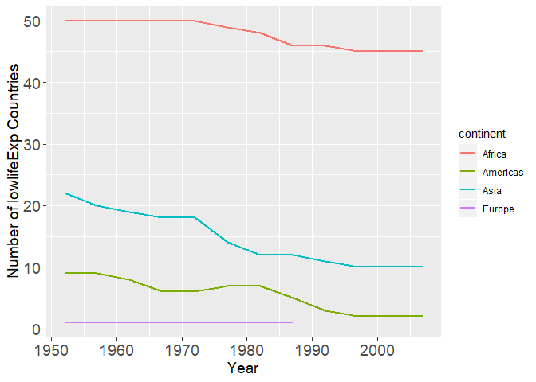
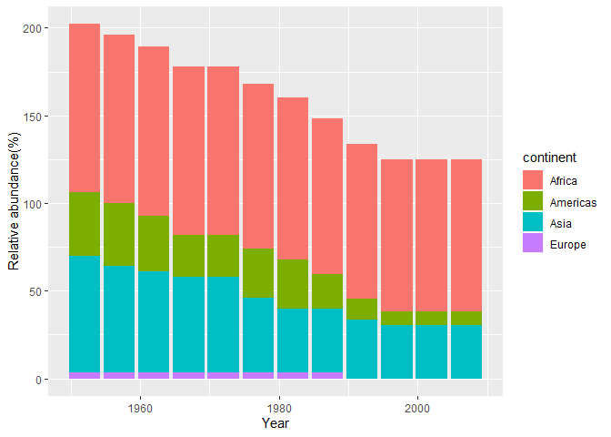
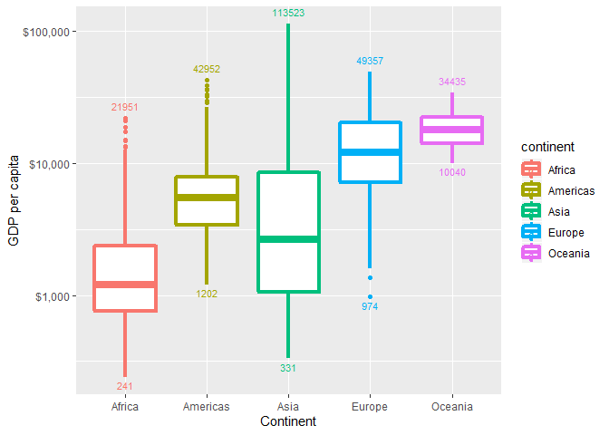
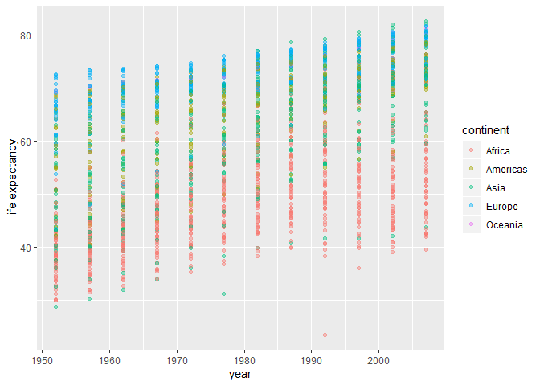
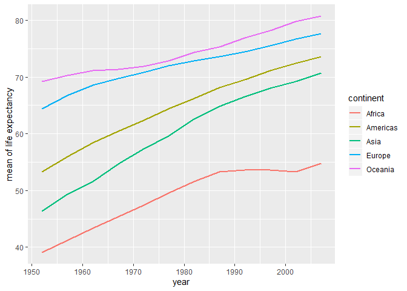
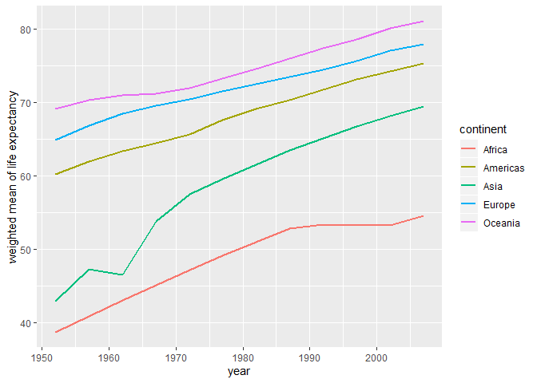

hw03-dplyr-ggplot2
================
Haohui Zhong
2019/9/30

# Outline

This assignment is a extension version which takes us to a higher level
exploration of datasets such as `gapminder`. Utilizing `dplyr` and
`ggplot2`, we are about to accomplish the goal of analysing and
visualizing the dataset. As usual, we need to load packages in the very
beginning.

``` r
library(gapminder)
library(tidyverse)
library(scales)
```

Now equipped with proper tools, we are ready to get familiar with them
by finishing the following tasks.

# Task 1

*Requirements:* Report the absolute or relative abundance of countries
with low life expectancy over time by continent. Then determine how many
countries on each continent have a life expectancy less than the chosen
benchmark, for each year.

Here we define life expectancy less than the mean value of life
expectancy across the world as `low` life expectancy.

``` r
gapminder %>% 
  group_by(year) %>% 
  filter(lifeExp < mean(lifeExp)) %>% 
  group_by(year, continent) %>% 
  summarise(lowlifeExpCount = length(continent))
```

    ## # A tibble: 44 x 3
    ## # Groups:   year [12]
    ##     year continent lowlifeExpCount
    ##    <int> <fct>               <int>
    ##  1  1952 Africa                 50
    ##  2  1952 Americas                9
    ##  3  1952 Asia                   22
    ##  4  1952 Europe                  1
    ##  5  1957 Africa                 50
    ##  6  1957 Americas                9
    ##  7  1957 Asia                   20
    ##  8  1957 Europe                  1
    ##  9  1962 Africa                 50
    ## 10  1962 Americas                8
    ## # ... with 34 more rows

The above chunk groups data by `year` and `continent`. Then compares
life expectancy of each country in each year with the chosen benchmark,
that is the `mean value` for the corresponding year and counts the
number of contries with low life expectancy within continents for each
year.

By visualizing the above results, we can present them in a better way.

``` r
# plotting
gapminder %>% 
  group_by(year) %>% 
  mutate(mean_lifeExp = mean(lifeExp)) %>% 
  group_by(continent) %>%
  filter(lifeExp < mean_lifeExp) %>% 
  group_by(year) %>% 
  count(continent) %>% 
  ggplot(aes(year,n, color = continent))+
  geom_line(size = 1)+
  xlab("Year")+
  ylab("Number of lowlifeExp Countries")+
  theme(axis.text = element_text(size = 14), axis.title = element_text(size = 14))
```

<!-- -->

From the graph, we can clearly see that Africa accounts for the largest
proportion of lowlifeExp countries. And neither countries in Oceania
have had low life expectancy ever since the year of observation, nor
countries in Europe have had since the late 1980s. There is a common
decreasing trend in numbers of low life expectancy countries among all
continents.

The above chunks show us the absolute abundance of low life expectancy
countries and now we are going to study the relative one, which focuses
on the relationship between number of low life expectancy countries
withn a continent and the total amount of them.

``` r
# plotting
gapminder %>% 
  group_by(year) %>% 
  mutate(mean_lifeExp = mean(lifeExp)) %>% 
  group_by(year, continent) %>% 
  mutate(total = n()) %>% 
  filter(lifeExp < mean_lifeExp) %>%
  group_by(year, continent) %>% 
  mutate(cc = n()) %>%
  select(continent, year, cc, total) %>% 
  mutate(ra = (cc / total)*100) %>% 
  distinct() %>%
  ggplot(aes(year, ra, fill = continent))+
  geom_bar(stat = "identity")+
  xlab("Year")+
  ylab("Relative abundance(%)")
```

<!-- -->

By studying absolute abundance, we learn exact values of each continent
for each year, while working on relative abundance shows variations
among continent within the same year.

# Task 2

*Requirements:* Obtain the maximum and minimum of GDP per capita for all
continents.

This task seems to be quite simple in the very beginning. All we have to
do is to group the data and compute minimum and maximum values of GDP
per capita within continents.

``` r
gapminder %>%
  group_by(continent) %>%
  summarise(min = min(gdpPercap), max = max(gdpPercap))
```

    ## # A tibble: 5 x 3
    ##   continent    min     max
    ##   <fct>      <dbl>   <dbl>
    ## 1 Africa      241.  21951.
    ## 2 Americas   1202.  42952.
    ## 3 Asia        331  113523.
    ## 4 Europe      974.  49357.
    ## 5 Oceania   10040.  34435.

``` r
t3 = gapminder
```

The above table shows minimum and maximum values of GDP per capita
within each continent over the years. We can further explore the GDP
data by studying ranges of GDP per capita of each continent and compare
these ranges with one another, etc.

``` r
# plotting
t3 %>%
  ggplot(aes(continent, gdpPercap, color = continent))+
  geom_boxplot(size = 1.5)+
  scale_y_log10(labels = scales::dollar_format()) +
  stat_summary(aes(label = round(10^..y..)), fun.y = min, geom = "text", size = 3, vjust = 1.5) +
  stat_summary(aes(label = round(10^..y..)), fun.y = max, geom = "text", size = 3, vjust = -1) +
  xlab("Continent") +
  ylab("GDP per capita")
```

<!-- -->

We can learn that both maximum and minimum values of Africa rank last
among continents, and that Asia has a extremely unequal distribution of
GDP per capita while distribution in Oceania is very intensive since
there are only two countries.

# Task 5

*Requirements:* Find out how life expectancy changes over time on
different continents.

Actually we’ve already gone through this part in `assignment 2`. This is
how we did it in `assignment 2`.

``` r
gapminder %>% 
  group_by(continent) %>% 
  ggplot(aes(color = continent,x = year, y = lifeExp))+
  geom_point(alpha = 0.4) +
  xlab("year")+
  ylab("life expectancy")
```

<!-- -->

We can barely see some trends, but this is not very efficient when
presenting data. So we can make some improvements by choosing mean
values of life expectancy of each continent as representatives of the
corresponding continent, instead of looking at all countries within the
continent.

``` r
# plotting
gapminder %>% 
  group_by(continent,year) %>% 
  mutate(meanlifeExp = mean(lifeExp)) %>% 
  ggplot(aes(color = continent,x = year, y = meanlifeExp))+
  geom_line(size = 1) +
  xlab("year")+
  ylab("mean of life expectancy")
```

<!-- -->

If we look at the point plot, we might draw the conclusion that Europe
enjoys an extremely long life expectancy, followed by Americas. But if
we use the line graph, we will see that Oceania actually has the longest
life expectancy. We would probably neglect data of Oceania in a point
plot due to the extreme limited number of it.

What if we also take population into consideration?

Things would be a little bit different.

``` r
# plotting
gapminder %>% 
  group_by(continent,year) %>% 
  mutate(meanlifeExp = weighted.mean(lifeExp,pop)) %>% 
  ggplot(aes(color = continent,x = year, y = meanlifeExp))+
  geom_line(size = 1) +
  xlab("year")+
  ylab("weighted mean of life expectancy")
```

<!-- -->

Such results remind us the importance of choosing a proper measurement
when conducting researches.
