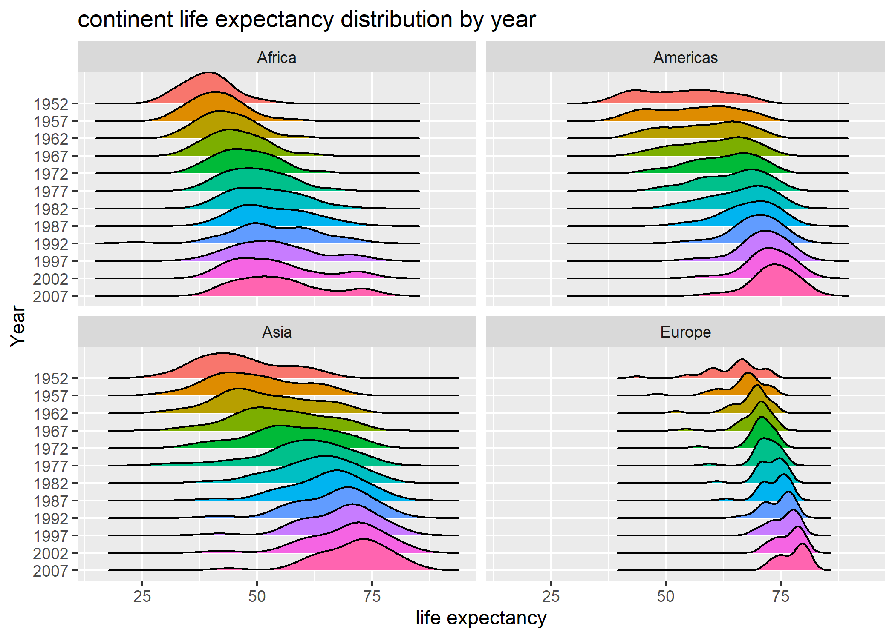

# Outline
We are going to integrate the tools we learned from the last few class meetings in this assignment. We will be working on factor management, import and export of files, visualization design and figure write-in. In the very beginning, let's load the packages we need.

```{r load, message=FALSE}
library(tidyverse)
library(gapminder)
library(forcats)
library(gridExtra) 
library(here)      
```

# Exercise 1
_Requirements:_ 
Explain the value of the here::here package with no more than 250 words.

***

The `here::here` function is very powerful for setting paths, mainly for the reasons listed below:

* The `here::here` function let programmers manage their sub-directories easily.

In a R project, the function recognizes the project root. But `here::here` is more than this. A .Rproj file is not necessary, since `here::here` works even in a non-project environment and comes before a project file.

* The `here::here` function works across different operating systems.

Every system has its own rules regarding to path. It is good to know them, but still people might forget or get lost. `here::here` always gives you the right answer to paths you should use in certain system.

* The `here::here` function adds another layer of feasibility to remote collaboration.

The `here::here` function sets your files free from your extremely personalized 'local path' jail and spares your collaborators from rewriting absolute paths on their own working directory. 
The first step to be a good citizen: use `here::here`.

* The `here::here` function could be someone's life saver.

Remember that Jenny's warning of setting those computers on fire? 


# Exercise 2: : Factor management
_Requirements:_ 
Choose one dataset and a variable which is a factor to explore.
- Drop factor / levels;
- Reorder levels based on knowledge from data.

## Drop Oceania
We are going to explore the `continent` variable in the `gapminder` dataset. First we need to confirm that it is a factor.

```{r}
gapminder$continent %>% 
  class()
```

With the above validation, now let's take a closer look at the variable.

_The number of levels of `continent` in the first-hand data:_
```{r}
nlevels(gapminder$continent)
```

And these levels are:
```{r}
levels(gapminder$continent)
```

_The number of rows of `continent` in the first-hand data:_
```{r}
nrow(gapminder)

```

***
At this point, we know for sure that the `continent` variable in the `gapminder` dataset is a `factor`. It contains 5 levels, namely Africa, Americas, Asia, Europe and Oceania, and  1704 rows in total. Then we can perform data manipulation by filtering the gapminder data to remove observations associated with the continent of `Oceania` and removing unused factor levels.

```{r}
dropocn <- gapminder %>% 
  filter(continent != "Oceania")

DT::datatable(dropocn)
```

```{r}
dropocn %>% 
  nrow()
```


```{r}
dropocn$continent %>% 
  droplevels() %>% 
  nlevels()
```

```{r}
dropocn$continent %>% 
  droplevels() %>% 
  levels()
```

After filtering and removing unused levels, the factor `continent` only contains 1680 rows in total and 4 levels(Africa, Americas, Asia and Europe). Oceania is now excluded from the dataset.

## Reorder the levels of country or continent

Here, we need to change the order of the factor levels based on summary statistic of one quantitative variable. Take `continent` as an example:

The statistic criteria I choose is minimun population over the years (1952 - 2007).

```{r}
order <- gapminder %>% 
  group_by(continent) %>% 
  summarize(minpop = min(pop))
DT::datatable(order)
```

Now it is still alphabetized in alphabetical order based on the first letter of the country's name. This is how it looks like in a plot:

```{r}
order %>% 
  ggplot(aes(minpop, continent, color = continent)) +
  geom_point(size = 1.5)+
  scale_x_log10()+
  xlab("minimum population")+
  ylab("continent")+
  theme_bw()
```

Let's reorder it.

```{r}
order %>% 
  ggplot(aes(minpop, continent)) +
  geom_point(aes(y = fct_reorder(continent, minpop, "identity"), color = continent)) +
  scale_x_log10()+
  xlab("minimum population")+
  ylab("country") + 
  theme_bw()
```

# Exercise 3: File input/output (I/O)
_Requirements:_
Experiment with at least one of:
- write_csv()/read_csv() (and/or TSV friends),
- saveRDS()/readRDS(),
- dput()/dget().

We will practise importing and exporting data with the `write_csv()/read_csv()` function.

First we make summarization of data and save as a .csv file.

```{r}
summarypop <- gapminder %>% 
  group_by(continent) %>% 
  summarize(meanpop = mean(pop), maxpop = max(pop), minpop = min(pop), sdpop = sd(pop), medpop = median(pop))

DT::datatable(summarypop)
```

```{r export}
summarypop %>% 
  write_csv(here::here("summarypop.csv"))
```

By importing the dataset back, we can further analyze it.

```{r import}
(summarypopim <- read_csv(here::here("summarypop.csv")))
```

But there are some unexpected changes during this 'export-import' process. 

```{r}
class(summarypopim$continent)
```

Oops! The factor variable `continent` got changed into a character somehow.

No worry. We are on the way to rescue the variable continent, by simple specify `col_types` in the `read_csv` function.

```{r}
(summarypopim <- read_csv(here::here("summarypop.csv"),
                         col_types = cols(continent = col_factor())))

```

Problem solved, yay! No let's play around with it.

```{r}
summarypopim$continent %>% 
  levels()
```

```{r}
summarypopim$continent %>% 
  nlevels()
```

The `summarypopim` dataset has 5 levels ordered alphabetically. Here is how it looks like in a plot:

```{r}
summarypopim %>% 
  ggplot(aes(continent, medpop, fill = continent))+
  geom_col()+
  xlab("continent")+
  ylab("median population by continent")
```

Let's reorder the data based on the median value of population.

```{r}
summarypopim %>% 
  ggplot(aes(continent, medpop, fill = continent))+
  geom_col(aes(fct_reorder(continent,medpop,min)))+
  xlab("continent")+
  ylab("median population by continent")
```

# Exercise 4: Visualization design
_Requirements:_
Create a side-by-side plot and juxtapose your first attempt to show the original figure with a revised attempt after some time spent working on it and implementing principles of effective plotting principles. Comment and reflect on the differences.

In this chapter, I am going to improve the visualization of data in my previous assgnment 03. 

 

```{r, message = FALSE}
old <- gapminder %>% 
  group_by(continent) %>% 
  ggplot(aes(color = continent,x = year, y = lifeExp))+
  geom_point(alpha = 0.4) +
  xlab("year")+
  ylab("life expectancy")

new <- gapminder %>% 
  filter(continent != "Oceania") %>% 
  mutate(year = factor(year)) %>%
  ggplot(aes(x = lifeExp, y = fct_rev(year), fill = year)) +
  ggridges::geom_density_ridges() +
  facet_wrap(~continent) +
  scale_x_continuous("life expectancy", labels = scales::comma_format()) +
  ylab("Year") +
  ggtitle("continent life expectancy distribution by year")+
  theme(legend.position = "none")

grid.arrange(old, new, ncol=2)

```

By comparing the two plots side by side, we can definely see a difference, although the new one is still not ready for a journal paper. Of course, we can briefly tell the range of life expectancy among countries within each continent form the left plot (old), but we are clueless about the distribution of the data and those summarized information. One key component I change is that I excluded the data of Oceania, since the limited number of data makes it really hard to look into density.


# Exercise 5: Writing figures to file
_Requirements:_
Use `ggsave()` to explicitly save a plot to file. Include the exported plot as part of the repository and assignment. Then, use `` to load and embed that file into the report.

Here we are going to save the plot created in Exercise 4, which better performs life expectancy distribution within each continent. Be aware of the tricky default setting that the `ggsave` function will automatically choose to save the last plot being displayed. In case it is not the plot we want to save, we need to specify it.

```{r}
ggsave(filename = here::here("lifeExpyrcon.png"), plot=new)
```

Now reload the plot we save.


